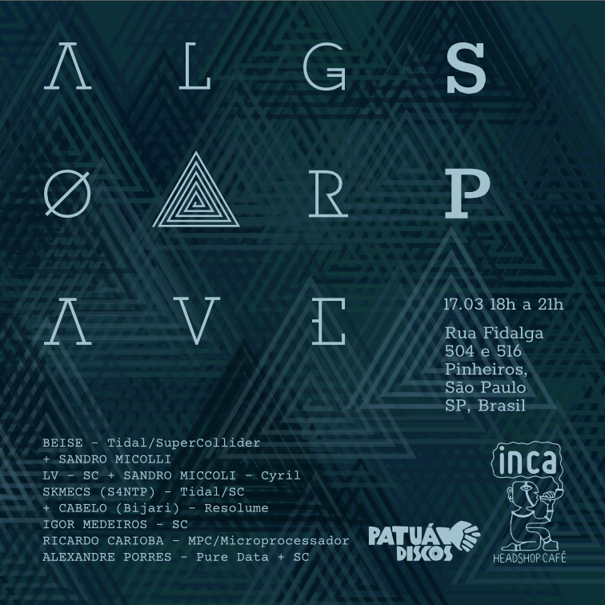

# Algorave

## Algorave SP 2018

<video width="640" height="640" controls>
  <source src="./videos/0102-0692.mp4" type="video/mp4">
  Your browser does not support the video tag.
</video>

Sao Paulo, March 17, 2018

On the occasion of the 6th anniversary of [Algorave](https://algorave.com/about/), AlgoSix was held in several cities around the world and also in São Paulo. All was streamed and joined in a three-day event.

Shortly after arriving in Sao Paulo after a period of five years living in Berlin would happen the world event commemorating the six years of the Algorave movement. As there was no one willing to do it and I thought it was important and pertinent to mark our presence at the event, to strengthen the Brazilian live-coding scene, I decided to produce and promote the first Algorave on Brazilian soil. Even without financial support some line up was formed of excellent artists and I had the support of many others.
Many others will come.

> Algorave has no DJ and no playback, has code! The instruments are the laptops. The music is live coded. Improvised and / or composed while playing. The codes are designed for everyone to follow and sing along.

My great gratitude to the artists who participated:

LV - SuperCollider + SANDRO MICCOLI  
BEISE TidalCyles + SuperCollider  
 \+ SANDRO MICCOLI - Cyril  
SKMECS (A Society for Non Trivial Pursuits) - TidalCycles + SuperCollider  
 \+ CABELO (Bijari) - Resolume  
RICARDO CARIOBA - MPC + Microprocessador  
ALEXANDRE PORRES - Pure Data + SuperCollider

### The gigs

<iframe width="560" height="315" src="https://www.youtube.com/embed/L_Z1cSNNH1Y" frameborder="0" allow="accelerometer; autoplay; encrypted-media; gyroscope; picture-in-picture" allowfullscreen></iframe>

<iframe width="560" height="315" src="https://www.youtube.com/embed/GmzerrJP_-E" frameborder="0" allow="accelerometer; autoplay; encrypted-media; gyroscope; picture-in-picture" allowfullscreen></iframe>

<iframe width="560" height="315" src="https://www.youtube.com/embed/kHiQ27KSqLY" frameborder="0" allow="accelerometer; autoplay; encrypted-media; gyroscope; picture-in-picture" allowfullscreen></iframe>

### All the streamings

#### [Algo6 Playlist](https://www.youtube.com/playlist?list=PLMBIpibV-wQIxnJ2juNj5CDfK6zF3Elcv)

---

## TOPLAP15 Birthday Celebration

17, February, 2019

> 86 hours of live streamed music and visuals from around the world in celebration of [TOPLAP](https://toplap.org/)'s 15th birthday.

This year I decided to focus on my session, so, I participated in from home sending my streamming.

<iframe width="560" height="315" src="https://www.youtube.com/embed/8SAunZxw0zs" frameborder="0" allow="accelerometer; autoplay; encrypted-media; gyroscope; picture-in-picture" allowfullscreen></iframe>

### All the streamings

#### https://www.youtube.com/playlist?list=PLMBIpibV-wQKVN8RtE_uCyk1E37A2qRZ5

[back to top](#algorave)
