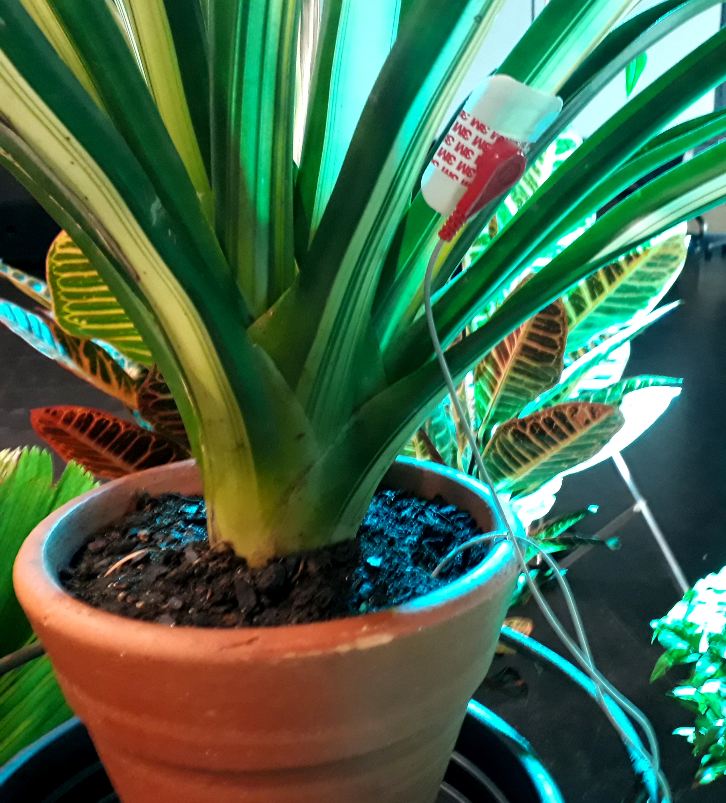
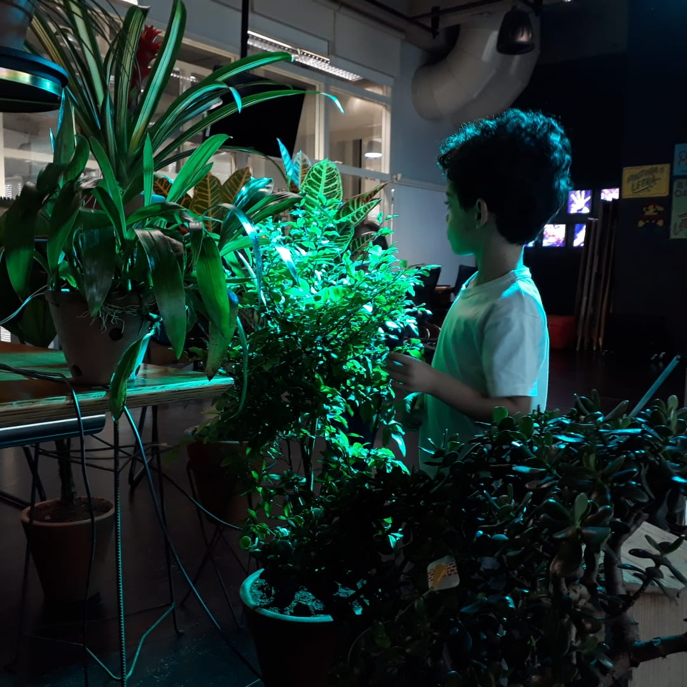
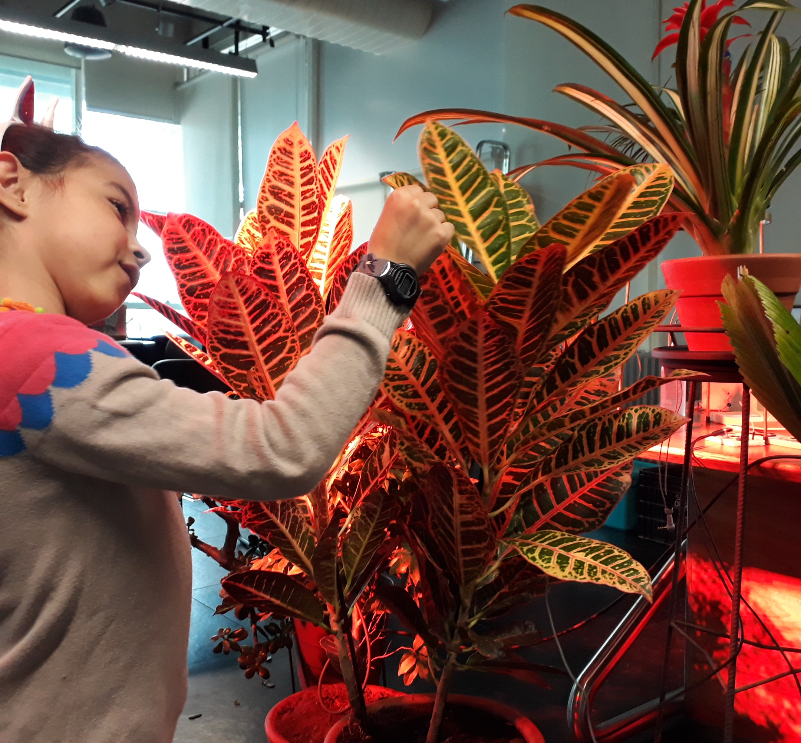
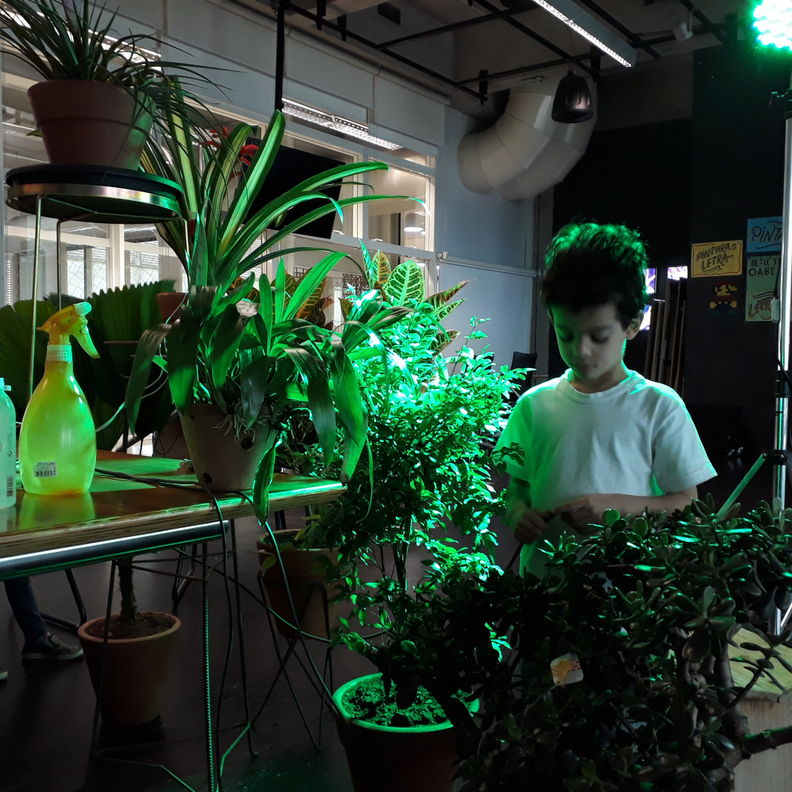
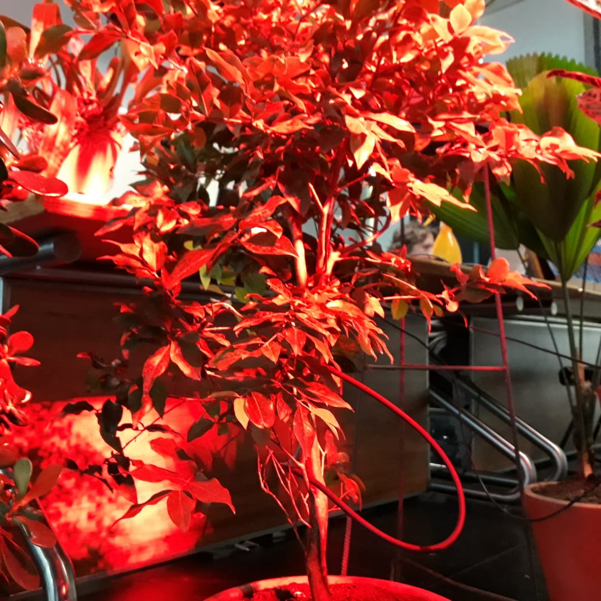

# Band of Plants

<!-- ### Plants + Arduino + Sensors + SuperCollider -->

**Band of Plants** is a three part project: workshop, jam and chat with the artist.  
Every part has to do with the experience of, with the help of technology, touching with the plants. Note: not **play the plants**, but, **play with** them.

<ClientOnly>
  <frac-tree class="ft" ref="ft" />
</ClientOnly>

## Workshop

In this workshop participants learn to translate into sound, the stimuli captured with the plants using sensors, Arduino and SuperCollider - a platform for audio synthesis and algorithmic composition. We start with an introduction to the SuperCollider and end up interacting with the plants, improvising together.

## Jam Interspecies

The artist Gil Fuser play with the plants, translating in sound their stimuli, captured with sensors, Arduino and SuperCollider. The audience have the opportunity to interact with the plants and thus influence the sound.

## Chat with the artist

After the jam the artist explains the technical and theoretical details involved in the performance and answers the questions of the interested. It exposes and breaks down sound-related codes, sensors, sensory aspects of plants, electronics, and data flow.

[back to top](#band-of-plants)

---

### Band of Plants for Children

02 June, 2018,  
Sesc Sto Amaro, Sao Paulo

On the occasion of the project Ideas and Actions for a New Time, conducted by the area of Education for Sustainability of Sesc São Paulo, I was invited to do stripped down version of **Band of Plants** adapted for children.  
For four hours children and accompanying adults were able to experiment with influencing the sound by playing with the plants and also could ask questions and talk about what was happening there.

[back to top](#band-of-plants)
