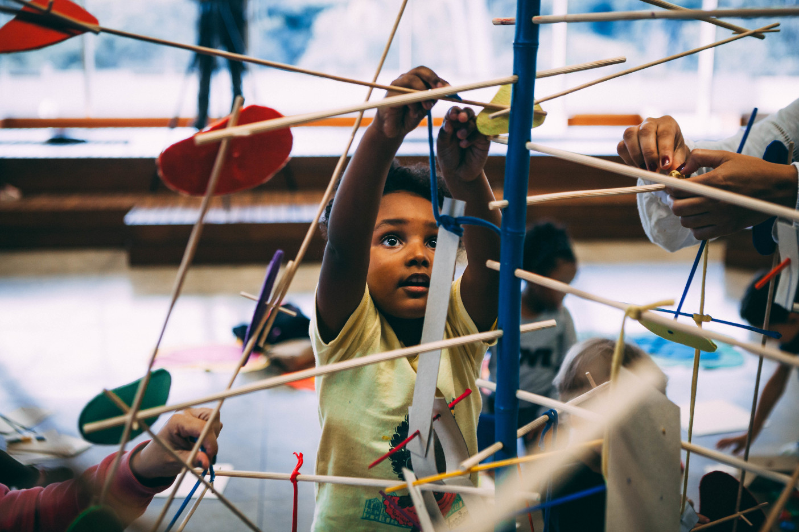
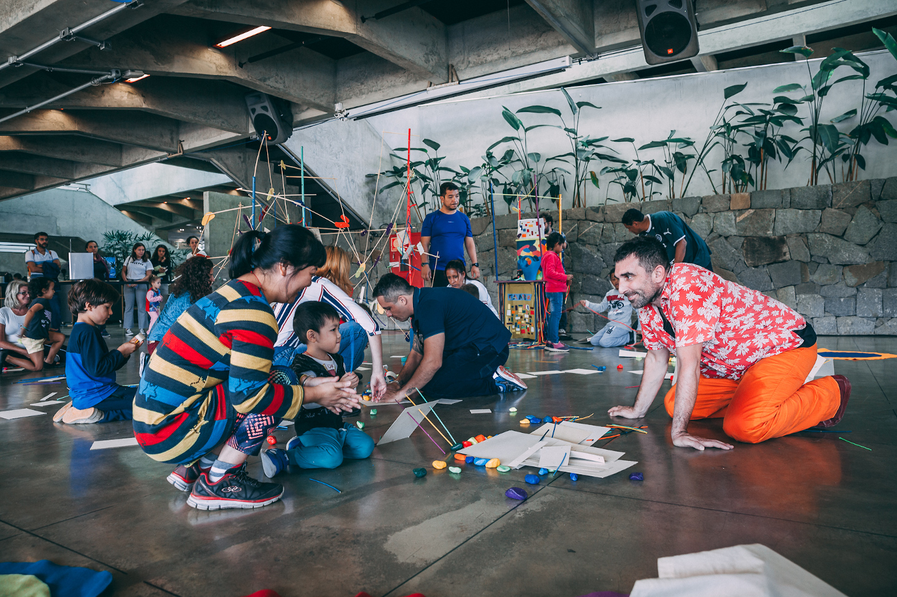
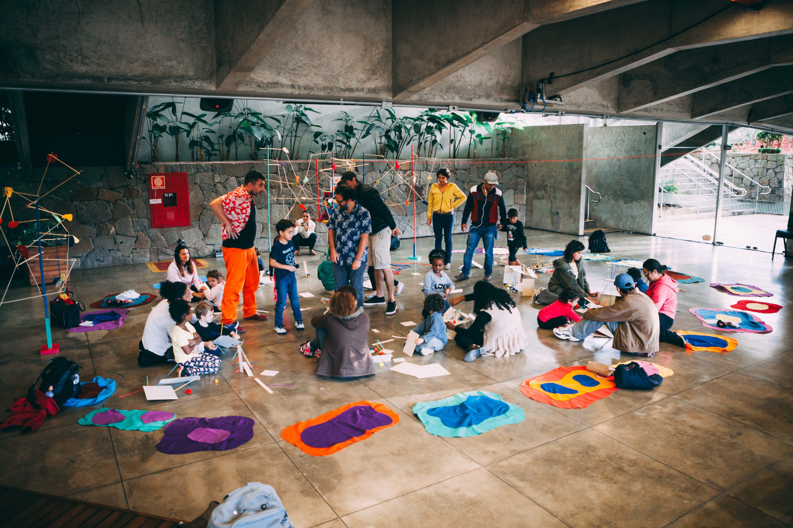
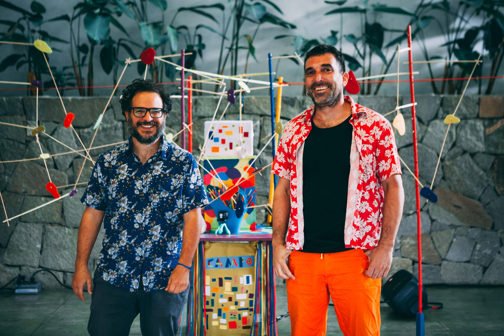

# C A M P O

> EVENT AND CREATION GAME WITH CHILDREN AND ACCOMPANYING PARTIES  
Performance by the artist Ieltxu Ortueta and live music by Gil Fuser for children up to 7 years old CAMPO aims to explore ways of relating to the materials in an open Game of affective experimentation that starts from principles of the visual arts, graphic design and performance, where the discovery of possibilities between adults, children and artists are field of study of the new work of [ARTEFACTOS BASCOS](https://www.artefactosbascos.com/)  
CAMPO brings materials found around the mountainous city where the Basque artist resides, Cunha, to other cities, sometimes more urban. C A M P O is game C A M P O is discovered C A M P O is affection C A M P O of intensities C A M P O is relation C A M P O is creation C A M P O of experimentation C A M P O of collective action C A M P O of possibilities C A M P O versus C I D A D E

I play music live through algorithms that dialogue with what happens during the development of the action.
Created along with the artist, the base of the track navigates between order and chaos, delicate and affirmative movements, rhythms and sound landscapes.

The development of the codes used went hand in hand with the development of a system especially for such, and a method of live-coding that provided both the freedom to play live and a certain self-protection to errors that could compromise the continuity of the action. For that I integrate SuperCollider's JitLib library, Tidal Cycles, which is where I do the live-coding itself, and VSTs for fine tuning related to sound quality.  
The system is shared here, along with a wiki article written for SuperCollider and Tidal Cycles users, whith an in-depth explanation of how it works.

<iframe style="width:100%;height:416px" src="https://www.youtube.com/embed/EVBPdNCnbog" frameborder="0" allow="accelerometer; autoplay; encrypted-media; gyroscope; picture-in-picture" allowfullscreen></iframe>

[back to top](#c-a-m-p-o)
