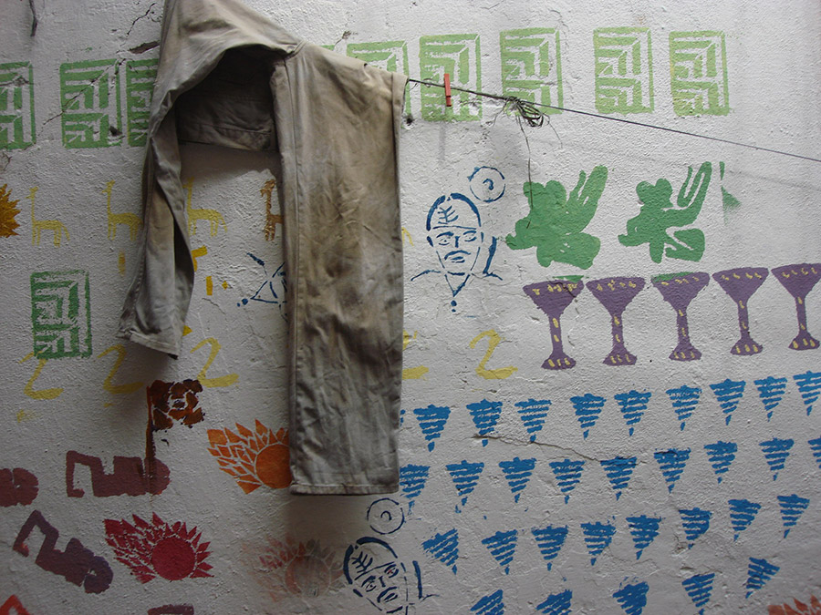

# Coopel Stencil Workshop

## Workshop for people of no fixed address at the Cooperative for waste recycling–Coorpel

### stylus, acrylic base, color pigments, x-ray plates, paper, pencils

São Paulo, August–November 2011

In the year 2011 I conducted a stencil workshop in the cooperative for waste recycling “Coorpel” in São Paulo for “people in street situation” (one could say “homeless” but this would not be a precise term) which were in process to be accepted as a member of the cooperative.

The workshop intended to broaden the expression ability of the participants, to encourage their creativity, increase their confidence, self-esteem and the capacity of comprehension of the world that surrounds them. While providing pleasant moments of teamwork and learning.

The stencil was chosen as the basis of the practice of this workshop to be a cheap, simple, practical process, full of possibilities for recombination, comprising in its production process basic elements of art such as drawing, use of color, composition, synthesis, figuring and abstraction.

The individualities would express themselves in favor of collective works by exchanging experiences and tasks. Thus the participants had the opportunity to learn from each other and notice that there are multiple paths and possibilities for expression or accomplishment of ideas.

The production made in one class served as the basis for discussion about what would come next. Thus a line joining one class to the other is created, and becomes clear the meaning of the workshop as a whole. By allowing themselves to prove that they can draw, make interesting and expressive compositions, making them uninhibited and demystifying
the artistic practice, we discussed the content of their productions. From then delved toward their imaginary, repertoires and experiences, giving new meanings to them through art, collectively.

Materialize the internal imagery, combine, compare, and mix with the collective imaginary, can be enlightening and making us feel part of a group whom we can share something similar. The classes were conducted respecting the repertoire of each.

While working around what makes sense for the participants and broaden their perception, reflection and sensitivity. Bringing new content, expanding their repertoire in relation to stencil, and similarly to street and graphic art as a whole. The concepts of “right and wrong” and “Beauty” did not take place on this workshop.

[back to top](#coorpel-stencil-workshop)
