# Curriculum Vitae

<br/>

```smalltalk
Nome: 'Gil Fuser'
Local_de_nascimento 'October 5, 1973 / São Paulo, Brasil'
Endereço: 'Rua Imaculada Conceição 81, apt 65, Vila Buarque, Sao Paulo, 01226-020'
Email: 'gilfuser@gmail.com'
N.Celular: '+55 11 988037789'
```

<br/>

## Mini-Bio

Acredito que acredita que as diferentes formas de arte devem ser colocadas em gavetas separadas. Minha pesquisa envolve várias formas de expressão e modos de envolvê-las para fazer emergir sentidos novos e abertos. Em meus trabalhos uso sensores, câmeras, objetos comuns do dia a dia, lixo, cabos, módulos de rádio, placas de prototipagem e computadores com softwares de código aberto. Entre 2014 e 2017, em Berlim/Alemanha, fui aluno convidado no curso Arte Gerativa / Arte Computacional na UdK (Universidade das Artes). Colaboro com artistas de lá e de outras partes, a partir de São Paulo. Produzo imagens e música para apresentações solo e em colaboração, como para a Society for Non-Trivial Pursuits (S4NTP) e o artista Ieltxu Ortueta. De 1997 a 2011 fiz design gráfico, desenvolvimento web e animação como freelancer e em revistas, estúdios de design, estúdios de comunicação e publicidade, tais como MTV Brasil, Rico Lins Studio, Editora Três, Touché Propaganda e Crioula Câmera.

<div class="page"/>

## 2019

---

### Escuta Ativa

26 de agosto a 6 de dezembro, Derdic (escola de ensino médio para jovens surdos), TUCA (Teatro da universidade Católica)

Classes for deaf young students, development of audiovisual instrument and sound design.

### C A M P O

Desde 25 de maio, Festival Paidéia, SESC Interlagos, Pompéia, em São Paulo, SESC Ribeirão Preto, Villa Grimaldi em Santiago, Chile

Música ao vivo feita através de códigos para a performance C A M P O.

> C A M P O como uma roça infinita, que pode atravessar cidades e potencializar encontros singulares e intensidades criativas.

<br/>

## 2018

---

<br/>

### Estação Maritaca

12 a 25 de outubro, SESC Pompéia, São Paulo

Por ocasião do evento Estação Maritaca no SESC Pompéia em outubro de 2018, criei duas traquitanas e dei uma oficina onde as crianças construíram um "brinquedo musical". A ideia por trás do evento, desenhada pela artista Mariana Piza, foi proporcionar às crianças experiências de uma emissora de rádio.

### Território Vital

05 de julho de 2018,
Instituto Tomie Ohtake, São Paulo

Performance em que quatro pessoas estão conectadas a sensores de frequência cardíaca e respiração.
Os dados extraídos dos sensores são transformados em parâmetros de sintetizadores digitais criados especialmente para a performance com o uso do SuperCollider.

<div class="page"/>

### Banda de Plantas para Crianças

02 de Junho de 2018,  
Sesc Sto Amaro, São Paulo

Por ocasião do projeto Ideias e Ações para um Novo Tempo, realizado pela área de Educação para a Sustentabilidade do Sesc São Paulo, fui convidado a fazer a versão despojada de **Banda de Plantas** adaptada para crianças.
Durante quatro horas, as crianças e os adultos acompanhantes puderam experimentar influenciar o som tocando com as plantas e também puderam fazer perguntas e falar sobre o que acontecia ali.

### Caixa Automágica de Música Sensorial

São Paulo, 12 de maio de 2018

Por ocasião do Scratch Day na Escola da Vila, propus algo diferente do [Scratch](https://scratch.mit.edu/), porém relacionado à arte e tecnologia: um instrumento em forma de caixa, tocado com luz e sombra, movimento ,vibração e botões.

### Algorave SP

São Paulo, 17 de março de 2018

Por ocasião do 6º aniversário da [Algorave](https://algorave.com/about/), a **AlgoSix** foi realizado em várias cidades do mundo e também em São Paulo. Tudo foi transmitido e unido em um evento de três dias.

Produção e divulgação da primeira Algorave no Brasil.

<br/>

## 2017

---

<br/>

### Akademie der Künste - Kontakte - Bienal de Música Eletroacústica e Arte Sonora - workshop Share Control, Share Influence (Compartilhar Controle, Compartilhar Influência)

O workshop foi focado nas “possibilidades oferecidas pela linguagem de programação SuperCollider para performances de música em conjunto baseadas em rede”.
Colaborei como docente no workshop, juntamente com Alexandra Cárdenas, Fredrik Orlofson, Hannes Hoelzlt e Alberto de Campo; também na preparação de uma versão SuperCollider *StandAlone* especialmente criada para o evento, para usuários de Linux e Windows. Suporte e instrução para os participantes.

### Nová Synagóga / Art Gallery Žilina, Slovakia

#### Coexistence, a performance night from the S4NTP in Zilina

Série de concertos curtos de participantes do S4NTP. O meu foi Liebesbrunnen - Performance audiovisual com o instrumento de mesmo nome.

### Deutschlandfunk Kultur - SAAVY Funk - Documenta

#### [Multiverse Crosstalk Radio](https://www.mixcloud.com/SAVVY_Funk/playlists/multiverse-crosstalk-radio/) - Utopia Network Music

Música de rede com codificação ao vivo com o S4NTP.

### Elysium Art Festival - Novilla, Berlin

**Bateria de códigos**  
Colaboração na performance de Isak Han “Metal Machine Music”, onde ele toca sons de feedback com um joystick, e eu toquei ao vivo na bateria usando o Tidal Cycles.  
Música em rede com codificação ao vivo em conjunto com a S4NTP no evento de abertura.

Sobre o evento, no site deles:

> De junho a setembro de 2017, artistas, curadores e cientistas participantes transformarão os poetas comoventes NOVILLA no genius loci de uma "ilha do abençoado Gesamtkunstwerk". Utopistas de steampunk, pintores, escultores, artistas, músicos, artistas de som e mídia encontram cientistas e fabricantes do sustentável, futurista, altamente econômico e biodegradável.

<br/>

## 2016

---

<br/>

### Fashion-show Unter - A collection of collections. Da Hochschule für Künste Bremen (Escola Superior para as Artes de Bremen) na Berlin Fashion Week

Composição usando técnicas generativas no SuperCollider.
Juntamente com Lindsey, Byrke Lou (direção musical) e Wolfgang Kick.

### The Society for Non Trivial Pursuits #110 @ Spektrum - Berlin

#### Canto Curioso

Imagens de paisagens naturais e gestos humanos comparados como movimentos orgânicos analisados com técnicas de visão computacional. Música e vídeo influenciam um ao outro em um sistema de *feedback*. Programado em OpenFrameworks e SuperCollider usando filmes feitos pelo grupo. Juntamente com Lisa-Maria Steppacher, Christian Hoehn, Isak Han e Luca Lomonaco. Desenvolvimento posterior ao workshop em Sauen do departamento de Arte e Mídia da UdK Berlim.

<br/>

## 2015

---

<br/>

### DATA JAM // NANO PPGAV UFRJ >>> <<< RAUM 111 MEDIENHAUS UDK BERLIN //

Dados provenientes de plantas no Solar do Jambeiro, em Niterói, no Rio de Janeiro, para a Sala 111, na UdK Medienhaus, em Berlim, usadas para gerar música e dados retornando para gerar música lá no RJ. Por ocasião do Hiper6. Evento realizado pelo NANO (Núcleo de Arte e Novos Organismos) da UFRJ (Universidade Federal do Rio de Janeiro).  
Foram usados SuperCollider, plantas e Pure-Data, todos se comunicando uns com os outros através de OSC.

[ouca trechos aqui](https://soundcloud.com/gilfuser/sets/datajam-favorites)

### Live-drawing Performance FLOU! - Brasil

Trilha sonora e sound-design, em colaboração com o artista Ieltxu Martinez Ortueta.  
Os sons traduzem os desenhos da dimensão espacial. Os sons respiram, reivindicam e expressam - algoritmicamente - o modo como os desenhos são formados.
A música move o corpo e o movimento se torna desenho, ou seria o contrário? Desenho e papel têm vida própria e se expressam através do som. Criar é dar vida a algo que já existe?

### Performance Margem Abandonada - Berlim, Hildesheim

Para atuação da atris e performer Mariana Senne.
Um conjunto de gravações de campo de São Paulo e Berlim que foram usadas como material para paisagens sonoras desenvolvidas usando o SuperCollider, com o qual eu procurei a interseção entre nossas paisagens sonoras internas e os sons familiares comuns da vida cotidiana.
Apresentado no Instituto de Teatro, Mídia e Cultura Popular da Universidade de Hildesheim.

### Moving Poets Festival – All That s Jazz, Novilla, Berlin

O Liebesbrunnen foi apresentado em um pequeno concerto acompanhado por uma dançarina no Festival Moving Poets.
REPUBLIC 111 - música em rede com a S4NTP.

### Music Makers Hacklab - A Score for Uncertainty, ICAS Festival, Dresden

Organizado pelo coletivo [Interspecifics](http://interspecifics.cc/work/) e Alberto de Campo, o Score for Uncertainty (Partitura para a Incerteza) foi um laboratório colaborativo de sete dias focado na criação de uma composição sonora de um futuro desconhecido usando instrumentos existentes e novos e catálogos de sons. Os participantes colaboraram em sessões intensivas de improvisação com o objetivo de analisar a maneira pela qual novos dispositivos poderiam estar envolvidos na criação de uma paisagem sonora futurista. O resultado foi apresentado como um concerto ao vivo no final da semana do [Festival ICAS](http://parsecmonitor.de/icasfestival/index.php) em Dresden.

### Avanti Screening I - projeção experimental de curtas-metragens, no Ehemaliges Stummfilmkino Delphi, Berlim

Criação e construção do instrumento audiovisual e escultura interativa Liebesbrunnen. apresentado no evento como uma escultura interativa. A seguir, a descrição que fiz para ele antes de construí-lo.  
> A instalação será um cilindro com muitos pequenos objetos, incluindo LEDs e discos piezoelétricos. Há uma webcam em um lado que captura o que acontece dentro de alguém quando alguém a move. A imagem é processada com Processing para criar camadas com base em atrasos e, portanto, adicionar a dimensão temporal como um via de sentido.

<div class="page"/>

### Geist Kino - Instalação *site-specífic* Zauberspiegel - Ehemaliges Stummfilmkino Delphi, Berlim

O evento Geist Kino foi apresentado no programa do Vorspiel do Festival Transmediale. O projeto tem suas origens no Brasil através do coletivo de artistas "Cine Fanstasma" e, consequentemente, no contexto do seminário superior "Atlas de Mediendências - Media Action in Berlin", do Prof. Dr. med. Siegfried Zielinski, adaptado para Berlim.
Zauberspiegel é uma instalação *site-specific*, com a qual se pode ver através do tempo e entre as dimensões da realidade cotidiana e as realidades dos filmes antigos, particularmente do expressionismo alemão. Através do espelho, a imagem facial de quem está na frente de Zauberspiegel se funde com o rosto de um personagem icônico dos filmes de antigamente. Por isso, cria um canal de comunicação que funciona nos dois sentidos.

<br/>

## 2013

---

<br/>

### Fanzine Reklamiertes Kapital - Zinefest Berlin

A artista Lina Tegtemeyer propôs a produção de uma versão de uma publicação independente para ser exibida no Zinefest Berlin. Minha versão do Fanzine Reklamiertes Kapital tinha poesias, fotos, fotografias e estêncis, tanto feitos por mim como por alguns dos participantes de um workshop que dei em São Paulo em 2011. As capas foram feitas com estêncis exclusivos e únicos para cada cópia.

<br/>

## 2012

---

<br/>

### Animação para o filme Nós Outros. Colaboração com o Estudio Anemona - Brasília / São Paulo

Como membro honorário do Estudio Anemona, criei uma série de pequenas animações para o filme Nós Outros, idealizado e dirigido por Marina Weis. As ilustrações são de Valentina Fraiz.  
> “Nós Outros” parte do Brasil para uma viagem pela América Latina. É um ensaio-filme, uma colagem subjetiva, onde, somando-se às palavras e imagens coletadas durante a viagem, estão trechos de filmes e registros de fatos políticos: lembranças de um passado latente que volta inquieto para desafiar o presente. Juntando-se, geografias, gerações e experiências tecem-se em formas de habitar o espaço, o corpo coletivo, a intimidade e, sobretudo, o nosso tempo.

<div class="page"/>

## 2011

---

<br/>

### Workshop de estêncil para pessoas que vivem em abrigos - Coorpel. São paulo

O workshop foi realizado na cooperativa de reciclagem de lixo, Coorpel. Pretendeu-se ampliar a capacidade de expressão dos participantes, estimular sua criatividade, aumentar sua confiança, autoestima e capacidade de compreensão do mundo que os cerca. Proporcionando momentos agradáveis de trabalho em equipe e aprendizado.
As individualidades puderam se expressar em favor de obras coletivas, trocando experiências e tarefas. Assim, os participantes tiveram a oportunidade de aprender uns com os outros e perceber que existem múltiplos caminhos e possibilidades de expressão ou realização de ideias.

<br/>

## 1997-2011

---

<br/>

Trabalho desde o final dos anos 1990 como designer gráfico, web-designer, webmaster, animador e diretor de arte, como freelancer, e em estúdios de design, revistas e agências de comunicação, publicidade e publicidade. Entre eles estão a MTV Brasil, o Rico Lins Studio, a Editora Três e a Touché Propaganda.

<div class="page"/>

# Portfolio

---

<br/>

# Escuta Ativa

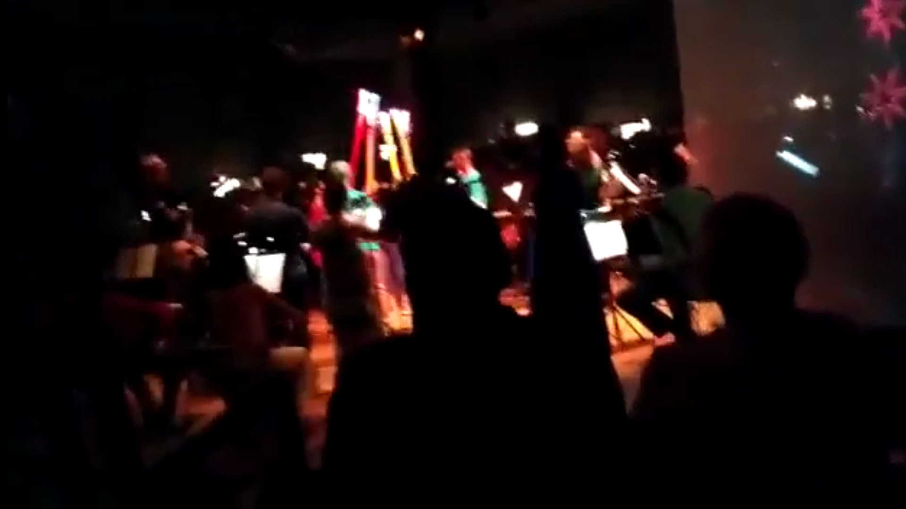

Escuta Ativa é um projeto da Orquestra Moderna, uma orquestra voltada para a popularização da música clássica. Em parceria com a escola para surdos do ensino médio Derdic, em São Paulo, ligada à PUC-SP, é um projeto que leva música a jovens surdos.
Em módulos semestrais, os jovens surdos têm contato com a música de modos não convencionais. Os módulos são finalizados com uma apresentação dos jovens surdos junto a orquestra, com regência e direção artística de Leonard Evers.

## do programa

> Neste terceiro módulo do projeto Escuta Ativa colocou-se um desafio transdisciplinar, envolvendo atividades de formação introdutórias nas áreas de computação física, visualização de dados, bem como expressão corporal. As atividades alimentaram o desenvolvimento, em paralelo, de um instrumento audiovisual que, a partir de dados gerados por movimento e coletados com um acelerômetro e giroscópio nele acoplado, gera simultaneamente imagens e sons, bem como altera os padrões luminosos de um anel de LEDs acoplado na extremidade do instrumento.</br></br>Partimos de um objeto que lhes era familiar: o mesmo tubo sonoro utilizado no primeiro módulo do projeto, para percussão corporal. Durante as muitas vezes confusa simultaneidade de atividades, colocou-se continuamente a pergunta: como fazer e fruir música para os olhos, para as mãos, para todo o corpo?</br></br>Replicado para uso colaborativo, o instrumento serviu de base para incorporar os fragmentos criativos gerados a partir dos encontros com os estudantes, formalizados nos quatro movimentos inseridos no concerto da Orquestra Moderna. Nestes, trabalhou-se despretensiosamente com uma noção expandida e difusa dos conceitos musicais de ritmo, melodia e harmonia.

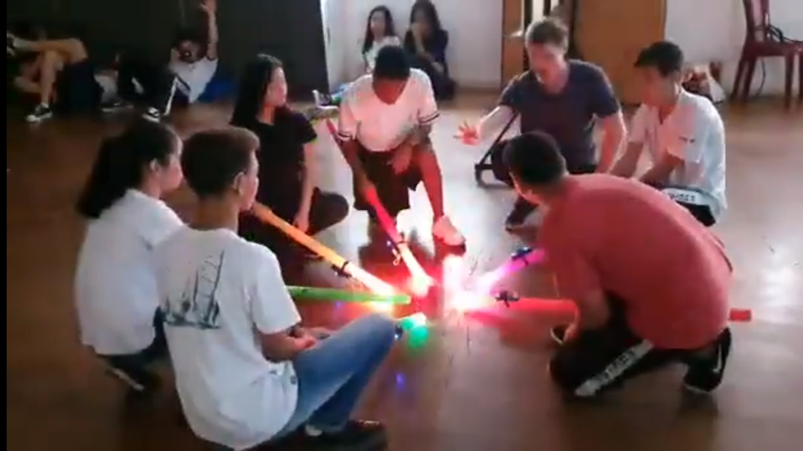

<div class="page"/>

# C A M P O


> ACONTECIMENTO E JOGOS DE CRIAÇÃO COM CRIANÇAS DE 0 A 7 ANOS E ACOMPANHANTES

C A M P O é uma proposta de criação artística coletiva e afetiva para crianças de 0 a 7 anos que acompanhadas por seus responsáveis participarão de um acontecimento criativo junto com o artista Ieltxu Ortueta e o músico Gil Fuser.

C A M P O é um jogo de combinações que nunca se fecha ou se esgota e que parte de um chão diagramado por retângulos e a instalação de pedras e galhos coloridos que vão procurando espaço, relação, campo de jogo e de possibilidades entre os jogadores. jogo de composição, de brincadeira e de descoberta para que JUNTOS, crianças “grandes” e pequenas, convivamos e criemos campos de possibilidades e de afeto. A música criada ao vivo pelo artista multimeios Gil Fuser é uma mistura de programação e música generativa (gerada por algoritmos que são escritos e modificados) partindo de samples e instrumentos digitais inventados que dialogam com o acontecimento que o performer Ieltxu Ortueta e os participantes vão criando.

C A M P O traz materiais encontrados no entorno da cidade montanhosa onde o artista basco reside, Cunha, para outras cidades, por vezes, mais urbanas.

C A M P O é jogo
C A M P O é descoberta
C A M P O é afeto
C A M P O de intensidades
C A M P O é relação
C A M P O é criação
C A M P O livre de experimentação
C A M P O de ação coletiva
C A M P O de possibilidades

C A M P O versus C I D A D E

---

A música é tocada ao vivo através de algoritmos que dialogam com o que acontece durante o desenvolvimento da ação.
Criada junto ao artista, a base da trilha navega entre ordem e caos, movimentos delicados e afirmativos, ritmos e paisagens sonoras.

O desenvolvimento dos códigos utilizados se deu concomitantemente ao de um sistema, e um método de codificação ao vivo que oferecesse tanto a liberdade de tocar ao vivo quanto uma certa autoproteção a erros que pudessem comprometer a continuidade da ação. Para isso eu integro a biblioteca [JitLib](http://doc.sccode.org/Overviews/JITLib.html) do SuperCollider, [Tidal Cycles](https://tidalcycles.org/), que é onde eu faço a codificação ao vivo, e [VSTs](https://en.wikipedia.org/wiki/Virtual_Studio_Technology) para ajustes finos relacionado à qualidade do som.

O sistema é compartilhado **[aqui](https://github.com/gilfuser/livecode-this)**, juntamente com um artigo wiki escrito para usuários do SuperCollider e Tidal Cycles, com uma explicação detalhada de como ele funciona.

---


<div class="page"/>

# Estação Maritaca


Por ocasião do evento Estação Maritaca no SESC Pompéia em outubro de 2018, criei duas traquitanas e dei uma oficina onde as crianças construíram um "brinquedo musical". A ideia por trás do evento, concebida pela artista Mariana Piza, foi proporcinar às crianças experiências de uma emissora de rádio.

<br/>

## Vitrola Maritrônica

A Vitrola Maritrônica é uma traquitana que mistura as possibilidades de um mixer, um toca-discos e um seletor de músicas, tudo em uma caixa com tampo transparente para que as crianças possam ver e ter curiosidade sobre os componentes que permitem o seu funcionamento.
As crianças podem fazer *scratch* usando um disco e um *crossfader*, escolher e combinar *loops* de músicas, alterar o volume e a velocidade com que esses *loops* são reproduzidos.
O design da caixa, o disco rotativo e a capa de acrílico são o artista e cenógrafo Julio Dojcsar.
A Vitrola Maritrônica foi arranjada em uma espécie de iglu (cenografia de Marisa Bentivegna) em que quatro crianças podiam interagir com a traquitana ao mesmo tempo.


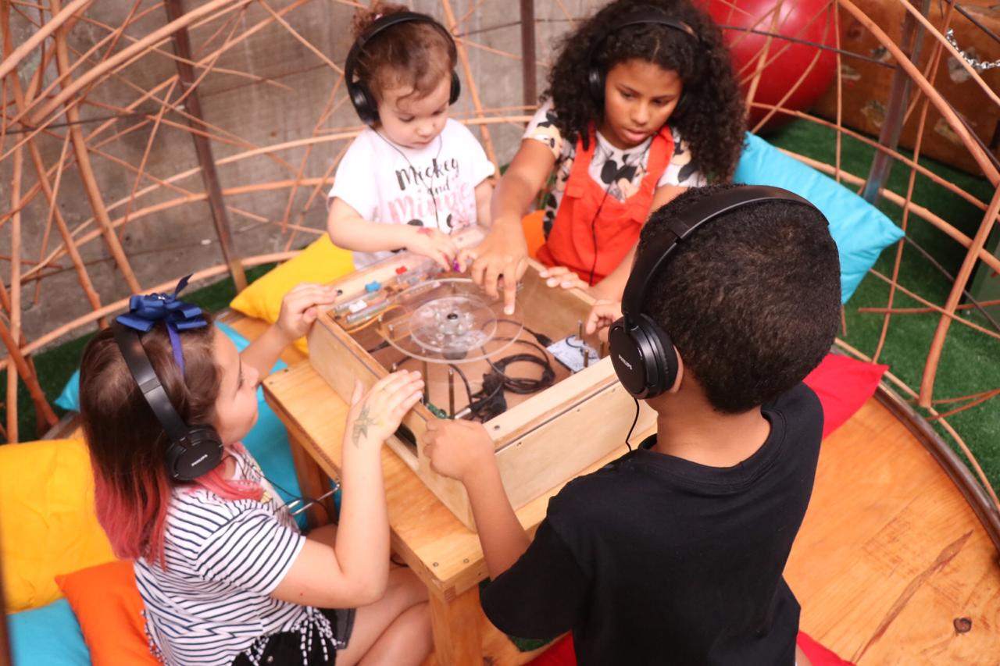


### O Funcionamento

Em termos superficiais, a **Vitrola Maritrônica** funciona da seguinte maneira:  
Duas placas de prototipagem, [Arduino](https://www.arduino.cc/) Duo e [Teensy Board](https://www.pjrc.com/teensy/), digitalizam e processam dados de *faders* e botões rotativos (*encoders*) bem como do disco giratório.
Um computador de placa única [Raspberry Pi](https://www.raspberrypi.org/) executando o [SuperCollider](https://supercollider.github.io/ "servidor de áudio, IDE e linguagem de programação para síntese de som e composição algorítmica ") com um programa especificamente escrito para o dispositivo.  
Uma placa de som especial para a Raspberry Pi transforma os sinais gerados pelo SuperCollider em som.

<div class="page"/>

## Gravador Maritaca


O Maritaca Recorder é um objeto com o qual as crianças ouvem dicas para que gravem histórias e façam entrevistas entre si. Através de uma interface simples, eles operam e gravam sem precisar de ajuda de adultos.
As gravações são armazenadas e disponibilizadas para uso no aplicativo Maritaca.

### Funcionamento

Dentro do gabinete de metal há uma placa de desenvolvimento Teensy conectada a uma placa de áudio específica, à qual o microfone e os fones de ouvido estão conectados. As gravações são armazenadas em um cartão SD.

<div class="page"/>

## Traquitrônica - Oficina de Brinquedo Musical

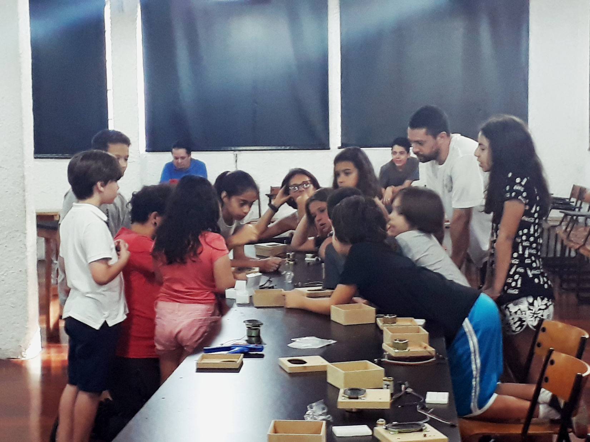

Nesta oficina destinada a crianças a partir dos sete anos de idade acompanhadas de adultos, construímos juntos instrumentos eletrônicos simples, com elementos simples, sem circuitos de solda ou complicados. Elas podem tocá-los com gestos, controlar a luz e os botões, e ainda combinar os instrumentos de uma com a da outra.
No final, os participantes podem levar seus instrumentos para casa.

### Os Objetivos

* aprender princípios básicos de elétrica, eletrônica e de áudio, a partir de atividades práticas.
* Construção de um instrumento eletrônico que pode ser levado pelos participantes.

### Especificidades

Com base em um circuito integrado, construímos em placas de prototipagem um circuito simples que gera pulsos elétricos em frequências audíveis, que ouvimos através de pequenos alto-falantes. Frequências podem ser moduladas usando sensores de luz e botões rotativos.
No final, como experimentação, os instrumentos podem ser combinados, gerando modulação cruzada e, assim, sons mais complexos.


<div class="page"/>

# Território Vital


Performance em que quatro pessoas estão conectadas a sensores de frequência cardíaca e respiracao.
Os dados extraídos dos sensores são transformados em parâmetros de sintetizadores digitais criados especialmente para a performance com o uso do [SuperCollider](https://supercollider.github.io/).  
Cada pessoa pode ouvir sons criados e transformados por seus próprios sinais vitais através de uma caixa de som posicionada atrás dela, bem como os sons dos outros através de cada um dos outros *speakers*.

Eu parto da hipótese de que ao fornecer *biofeedback* e *neurofeedback* de um grupo de pessoas através de sons, seus ritmos internos se harmonizam. Com "harmonia", não quero propor que elas se fundam em uníssono, mas que as proporções entre os sons individuais sejam equilibradas e desse equilíbrio emerge um som harmonioso, no qual as proporções são auto-equilibradas e não caóticas.

## Mostra dos alunos da Escola Entrópica

05 de julho de 2018,
Instituto Tomie Ohtake, São Paulo


<div class="page"/>

# Banda de Plantas

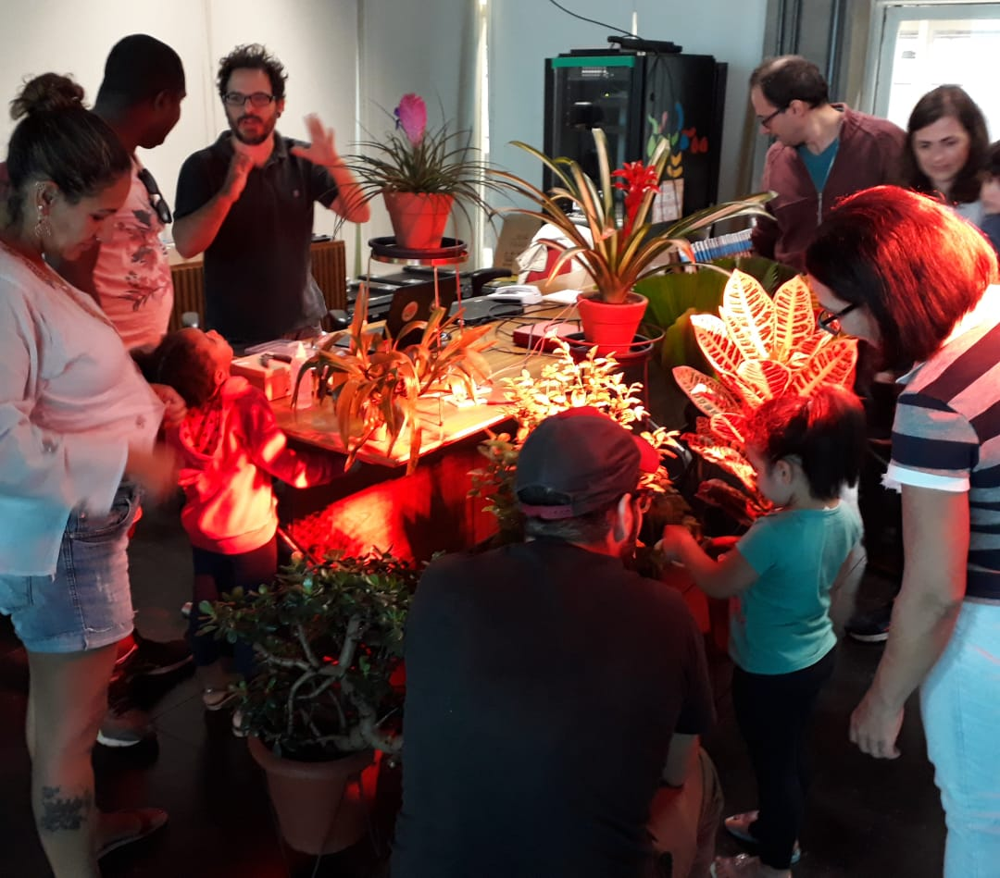

<!-- ### Plants + Arduino + Sensors + SuperCollider -->

Banda de Plantas é um projeto de três partes: oficina, jam e bate-papo com o artista.
Cada parte tem a ver com a experiência de, com a ajuda da tecnologia, tocar com as plantas. Nota: não **tocar as** plantas, mas, **tocar com** elas.

<br />

## Workshop

Neste workshop os participantes aprendem a traduzir em som, os estímulos capturados com as plantas utilizando sensores, [Arduino](https://www.arduino.cc/) e [SuperCollider](https://supercollider.github.io/ ). Começamos com uma introdução ao SuperCollider e terminamos interagindo com as plantas, improvisando juntas.

## Jam Interespécies

O artista Gil Fuser toca com as plantas, traduzindo em som seus estímulos, captados com sensores, Arduino e SuperCollider. O público tem a oportunidade de interagir com as plantas e, assim, influenciar o som.

## Bate-papo com o artista

Depois da jam o artista explica os detalhes técnicos e teóricos envolvidos na performance e responde as perguntas dos interessados. Ele expõe e esmiuça os códigos relacionados ao som, sensores, aspectos sensoriais de plantas, eletrônicos e fluxo de dados.

<br/>

### Banda de Plantas para Crianças

02 de Junho de 2018,  
Sesc Sto Amaro, Sao Paulo

Por ocasião do projeto Ideias e Ações para um Novo Tempo, realizado pela área de Educação para a Sustentabilidade do Sesc São Paulo, fui convidado a fazer a versão despojada de **Banda de Plantas** adaptada para crianças.
Durante quatro horas, as crianças e os adultos acompanhantes puderam experimentar influenciar o som tocando com as plantas e também puderam fazer perguntas e falar sobre o que acontecia ali.


<div class="page"/>

# Caixa Automágica de Música Sensorial

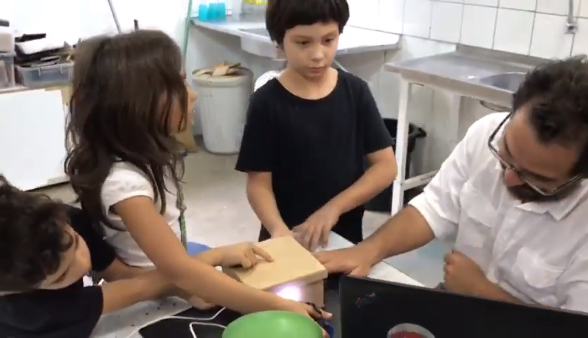
Por ocasião do Scratch Day na Escola da Vila, propus algo diferente do [Scratch](https://scratch.mit.edu/), porém relacionado à arte e tecnologia: um instrumento em forma de caixa, tocado com luz e sombra, movimento ,vibração e botões.


> A caixa pode ser aberta para que você possa ver por dentro como ela funciona e o inventor-artista pode explicar tudo para quem quer saber sobre os sensores, elementos eletrônicos e códigos que fazem a mágica acontecer.

<div class="page"/>

# Algorave SP

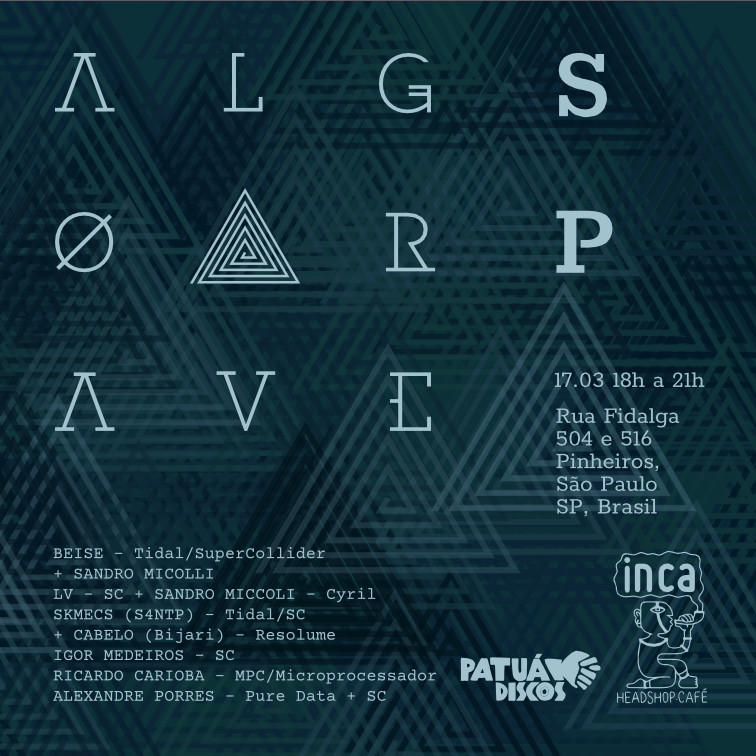

São Paulo, 17 de março de 2018

Por ocasião do 6º aniversário da [Algorave](https://algorave.com/about/), a **AlgoSix** foi realizado em várias cidades do mundo e também em São Paulo. Tudo foi transmitido e unido em um evento de três dias.

Logo após chegar em São Paulo após um período de cinco anos vivendo em Berlim, aconteceria o evento mundial comemorativo dos seis anos do movimento Algorave. Como não havia ninguém disposto a fazê-lo e achei que era importante e pertinente marcar nossa presença no evento, para fortalecer a cena brasileira de *live-coding*, decidi produzir e promover a primeira Algorave em solo brasileiro. Mesmo sem apoio financeiro, alinhei-me com excelentes artistas e tive o apoio de outros tantos.  
Muitas outras virão!

> Algorave não tem DJ e não tem playback, tem código! Os instrumentos são os laptops. A música é codificada ao vivo, improvisada e/ou composta enquanto é tocada. Os códigos são projetados para que todos sigam e cantem junto.

Imensa gratidão aos artistas que participaram:

LV - SuperCollider + SANDRO MICCOLI  
BEISE TidalCyles + SuperCollider  
 \+ SANDRO MICCOLI - Cyril  
SKMECS (A Society for Non Trivial Pursuits) - TidalCycles + SuperCollider  
 \+ CABELO (Bijari) - Resolume  
RICARDO CARIOBA - MPC + Microprocessador  
ALEXANDRE PORRES - Pure Data + SuperCollider  
LUIZA XAVIER - Streaming

<br/>

## TOPLAP15 - Celebração de Aniversário

17 de fevereiro de 2019

> 86 horas de música transmitida ao vivo e visuais de todo o mundo em comemoração ao 15º aniversário do [TOPLAP](https://toplap.org/).

Este ano decidi focar na minha sessão, então, participei de casa enviando o meu *streaming*.

<br/>

### [TOPLAP15 Birthday Celebration Playlist](https://www.youtube.com/playlist?list=PLMBIpibV-wQKVN8RtE_uCyk1E37A2qRZ5)

<div class="page"/>

# Flou

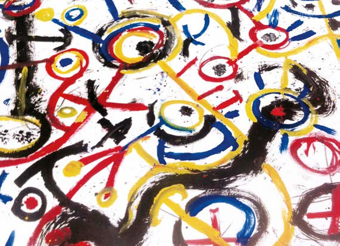

Fui convidado para criar os sons e a música de sua performance ao vivo: FLOU! por Ieltxu Martinez Ortueta, um multi talentoso artista e pai, como ele explica abaixo. Os conceitos que ele lida combinando movimentos corporais, desenho e pintura, recortes e também street-art, são análogos aos que venho lidando em minha prática de mídia-arte. Diferentes linguagens se cruzam para abrir possibilidades de uma multiplicidade de significados e interações.

> FLOU! é uma performance interativa para crianças de 4 a 10 anos que sentados ao redor de uma grande folha branca assistem e participam da criação ao vivo de um grande desenho. Os rabiscos dançantes e as tintas vão tomando vida e dialogam com o performer para que “alguns desenhos depois” surjam outros desenhos recortados feitos em experiências anteriores. Essas formas [peças] tomam conta do espaço e são as crianças que brincam compondo novos desenhos e formas e resinificando o acontecimento. Paralelamente, o desenho criado também é recortado pelo performer, gerando mais peças que alimentam o jogo e que serão utilizadas pelas crianças participantes das próximas experiências. Uma experiência coletiva, interativa e aberta que não fecha significados e que se propõe a brincar “seriamente”como toda criança faz.

<br/>

Os sons traduzem os desenhos para a dimensão espacial. Eles respiram as reivindicações e expressam algoritmicamente o modo aleatório com que os desenhos são formados. Som e música no FLOU! são a dimensão que conecta o designer ao desenho. A música move o corpo e o movimento se torna desenho, ou seria o contrário? Desenho e papel têm vida própria e se expressam através do som. Criar é dar vida a algo que já existe?

<br />

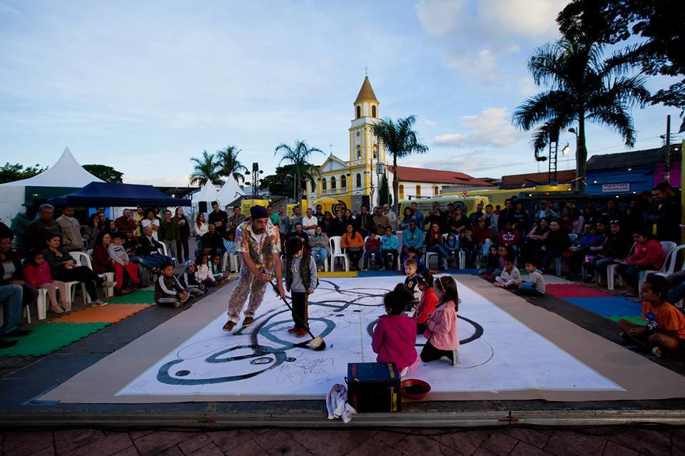

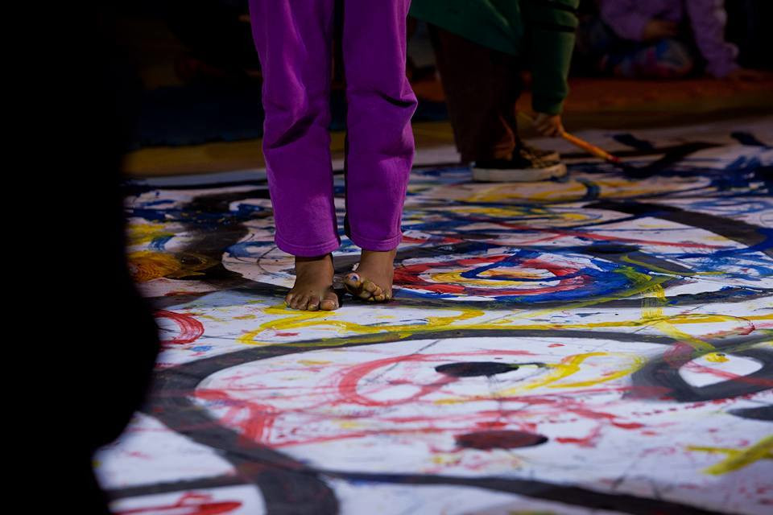

<div class="page"/>

# Liebesbrunnen

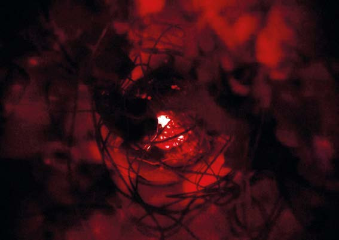

O Liebesbrunnen é um meio (ou corpo, talvez) que contém amor. Não se destina a fornecer respostas. É uma maneira possível de observar, experimentar, brincar e se conectar com o que acontece dentro de nós. Isso mostra que o amor não é tão bonito, puro e limpo, como se pode pensar. Movimentos grandes e pequenos podem causar mudanças drásticas no interior. O Liebesbrunnen depende da observação, experimentação, gestos em escala humana. Em seu *momentum*, cria sentido e acrescenta uma nova camada de significado, propondo uma pergunta: quanto amor depende da interação?

O Liebesbrunnen foi originalmente criado como uma instalação audiovisual no início de 2015 para a primeira edição do festival Avanti - curtas-metragens experimentais - realizada no antigo cinema mudo, ou Ehemaliges Stummfilmkino - Delphi, em Wedding, Berlim. Nesta edição, o tema do Avanti foi **O Amor Conceitual**.


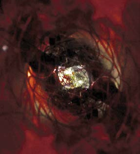

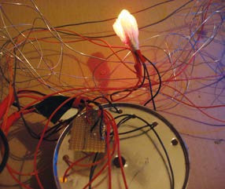
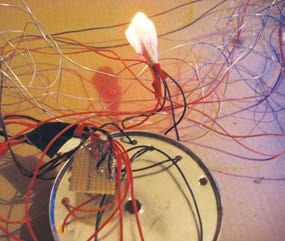
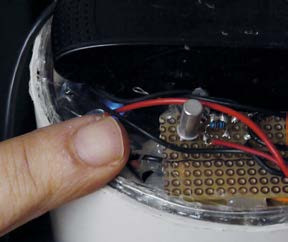
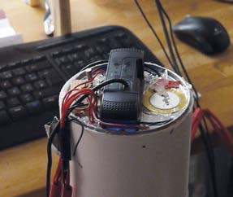
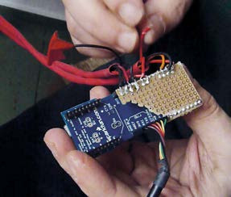

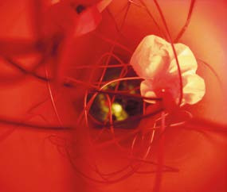
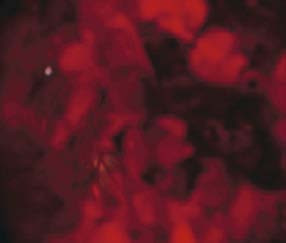

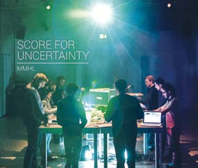
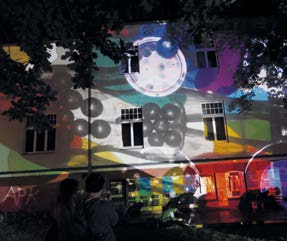

<div class="page"/>

## ATOS COM O LIEBESBRUNNEN

### Coexistence

Nová Synagóga / Art Galery Žilina, Slovakia, 2016

#### A performance night from the S4NTP in Zilina.
Serie de concertos com os participantes da S4NTP (Society for Non-Trivial Pursuits).

### Moving Poets Festival–All That s Jazz

Schöneweide, Berlin,  
11t de julho de 2015.

O Liebesbrunnen foi apresentado em um pequeno concerto acompanhado por uma dançarina no Festival Moving Poets. Naquela ocasião, alguns colegas também tocavam concertos curtos, e em conjunto, tocávamos música em rede.

Do website [Moving Poets](https://movingpoets.org/concrete5/index.php/novilla):

> Moving Poets é uma comunidade internacional de artistas. Nosso foco é dar a artistas de vários campos, culturas e grupos etários a oportunidade de inspirar uns aos outros e criar coletivamente em um lugar de reciprocidade.

### Music Makers Hacklab–A Score for Uncertainty

ICAS Festival, Dresden,  
27 de abril a 3 de maio de 2015.  
The album HMML–Score for Uncertainty is available [here](https://mmhl.bandcamp.com/album/score-for-uncertainty).

> Organizado pelo coletivo [Interspecifics](http://interspecifics.cc/work/) e Alberto de Campo, o Score for Uncertainty (Partitura para a Incerteza) foi um laboratório colaborativo de sete dias focado na criação de uma composição sonora de um futuro desconhecido usando instrumentos existentes e novos e catálogos de sons. Os participantes colaboraram em sessões intensivas de improvisação com o objetivo de analisar a maneira pela qual novos dispositivos poderiam estar envolvidos na criação de uma paisagem sonora futurista. O resultado foi apresentado como um concerto ao vivo no final da semana do [Festival ICAS](http://parsecmonitor.de/icasfestival/index.php) em Dresden.

### UdK Medienhaus Rundgang

20 de julho de 2015.  

O Liebesbrunnen apresentado na famosa sala 111. Toda a glória do sistema de som da sala contribuiu para uma sessão profunda e intensa com o Liebesbrunnen.

<div class="page"/>

### Spektrum, 14 de fevereiro de 2016

O Liebesbrunnen apresentado como parte das apresentações regulares da S4NTP no Spektrum, *um espaço de convergência para a cultura comunidades e grupos transdisciplinares emergentes e operando dentro e fora de Berlim*.

### Avanti Experimental Film Screening

Ehemaliges Stummfilmkino Delphi Wedding,  
30 de fevereiro de 2015, Berlim

Apresentado como uma escultura interativa, o público teve a oportunidade de experimentar o Liebesbrunnen ao ver a projeção feita por ele.

<div class="page"/>

# Margem Abandonada

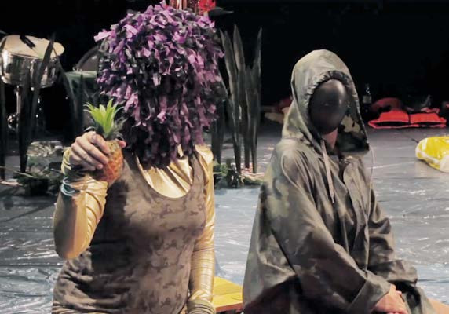

A atriz e *performer* Mariana Senne me convidou com uma idéia ampla sobre sons e música que ela gostaria de ter na performance que estava criando junto com as também teatrólogas Gianna Pargätzi (HI / GI) e Laura Kallenbach, o artista visual Jan Brokov e a coreógrafa Lu Favoreto. Uma colaboração entre artistas brasileiras e alemãs. A inspiração para a sua performance é o texto da Heiner Müller Landschaft mit Argonauten. Medea, filha do Sol, uma estrangeira, cidadã de segunda classe, poderia ser a própria Senne, uma brasileira na Europa hoje em dia: uma ilha de fascinação e medo para os estrangeiros. A identidade cultural (ou deveríamos dizer financeira?) Era uma questão central da perfomance. Os significados, as razões e como é ser brasileiro na Alemanha e na Europa.

Eu tinha um conjunto de gravações de campo que fizera em São Paulo (de onde nós dois viemos) que foram usadas como material para paisagens sonoras com as quais tentei encontrar onde nossas paisagens sonoras internas atendem aos sons comuns e familiares da vida cotidiana. Duas dessas paisagens sonoras foram imediatamente incorporadas ao processo de ensaio e pesquisa. Nesse meio tempo pude desenvolver por intermédio do SuperCollider novas paisagens sonoras, mesclando gravações de campo feitas tanto em São Paulo quanto em Berlim, de uma forma que deveria ser fácil e flexível para ser adaptada e acompanhar os processos criativos da performance. Existem três instrumentos feitos de código. Dois para as gravações de campo. Um faz pedaços de sons mais cortados e um altera a velocidade da reprodução como um toca-discos. Ambos são feitos para serem tão transparentes quanto possível. Com isso quero dizer que não deveria estar muito claro o que eles fazem. As camadas e texturas que eles criam têm uma abordagem analógica de lidar com os *samples*. O terceiro instrumento é percussivo e tonal feito apenas a partir de *ruído branco*. Os diferentes envelopes fazem com que se comportem como vários instrumentos e também dão espacialização.

### [Código em SuperCollider](https://github.com/gilfuser/margem-abandonada)

<div class="page"/>

# Zauberspiegel

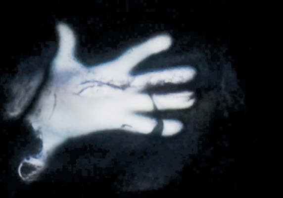

O Zauberspiegel foi minha contribuição para o evento Ghost Cinema. É uma instalação *site-specific* com a qual se pode ver através do tempo e entre as dimensões da realidade cotidiana e as realidades dos filmes antigos, particularmente do expressionismo alemão. Através do espelho, a imagem facial de quem está na frente de Zauberspiegel se funde com o rosto de um personagem icônico dos filmes de outrora. Por isso cria um canal de comunicação que funciona nos dois sentidos. Os personagens se tornam humanos e as pessoas comuns interagem com uma cena de outra dimensão e outro tempo.

Seu design foi inspirado no velho truque dos Parques de Diversão, onde uma mulher é transformada em gorila. O truque é baseado na diferença de luminosidade em lados diferentes de um espelho que reflete apenas o lado onde há mais luz. Usando a mesma lógica, usei LEDs infravermelhos, uma webcam, um vidro com revestimento preto semitransparente de um lado e uma tela branca do outro. Por trás de tudo um projetor projetando os rostos dos personagens apenas quando havia movimento.

A partir do *release* do evento, escrito por Paola Barreto:

> A extinção do cinema é um fenômeno global que tem sido observado nos últimos 30 anos em muitos países. Isso pode estar relacionado à cultura do medo, que vem redefinindo os espaços urbanos e empurrando cinemas para os shoppings, mas também para novas formas de distribuição de filmes - televisão, home video, internet - em que os cinemas não são mais um espaço privilegiado. Se se pode dizer que o cinema sempre foi um fantasma - um espectro de certa forma -, o que poderia o fim dos antigos palácios cinematográficos nos ensinar sobre a natureza do cinema? Para usar a *portmanteau* inventada por Gregory Ulmer, qual é o mistério na decadência desses edifícios? O Ghost Cinema aborda essas questões através de uma série de intervenções em vídeo, que ocupam cinemas desativados. Partindo de uma cartografia afetiva de edifícios abandonados, demolidos ou simplesmente transformados em outra atividade, o projeto conta com a colaboração espontânea de espectadores do cinema e tem sido apresentado em diferentes cidades.
As memórias compartilhadas em uma rede colaborativa são indexadas em um banco de dados, e os dados são combinados e projetados sobre os edifícios em uma sessão de Live Cinema, misturando materialidade, medialidade e temporalidade. Como afirma Jacques Derrida, os arquivos não estão lidando com o passado, mas com o futuro. O Ghost Cinema homenageia os cinemas mortos, trazendo-os de volta à vida em uma sessão mediúnica, mas mais do que isso, ele quer discutir possíveis futuros para os edifícios e seus arredores, e novas arquiteturas para o compartilhamento de imagens.

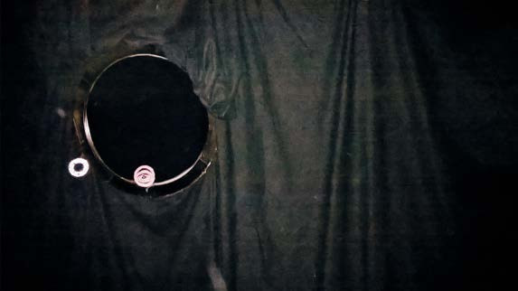
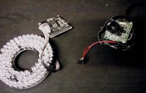

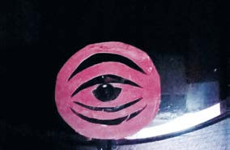
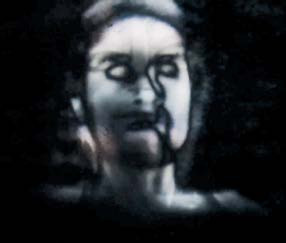

<div class="page"/>

# Reklamiertes Kapital

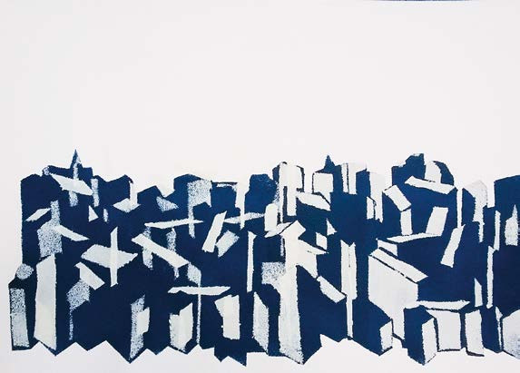

Em outubro de 2013, a artista gráfica e ilustradora Lina Tegtemeier me convidou para trabalhar com ela em um fanzine (uma publicação independente). Trabalhamos juntos, mas com versoes individuais.  
Fiz minha versão com poesia, fotos, minhas próprias fotografias e estêncils , alguns feitos por mim e outros dos participantes de um workshop que dei em São Paulo 2011. As capas foram feitas com stencils exclusivos e únicos para cada exemplar.

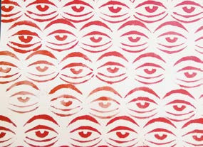
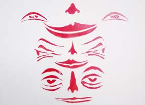

<div class="page"/>

# Nós Outros

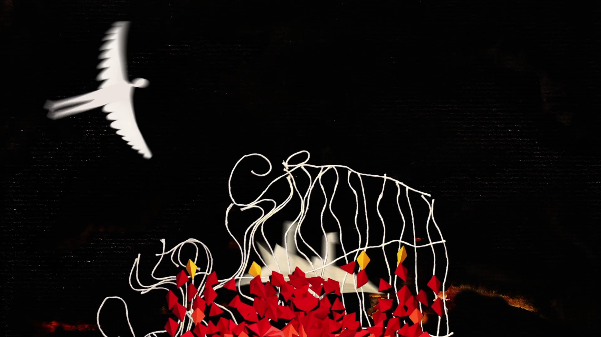

Como membro honorário do [Estudio Anemona](https://anemonaestudio.tumblr.com/) criei no ano de 2012 uma série de curtas animações para o filme Nós Outros, idealizado e dirigido por Marina Weis. As ilustrações são de Valentina Fraiz, a encantadora de anêmonas.

Da página do Vimeo com o teaser:

> “Nós Outros” parte do Brasil para uma viagem pela América Latina. É um ensaio-filme, uma colagem subjetiva, onde, somando-se às palavras e imagens coletadas durante a viagem, estão trechos de filmes e registros de fatos políticos: lembranças de um passado latente que volta inquieto para desafiar o presente. Juntando-se, geografias, gerações e experiências tecem-se em formas de habitar o espaço, o corpo coletivo, a intimidade e, sobretudo, o nosso tempo.

<div class="page"/>

No início, o objetivo das animações era esclarecer em quais cidades a ação ocorreu e como créditos finais.
Embora todos os elementos nas animações correspondam a uma determinada cidade latino-americana, mais tarde, o papel deles mudou para teasers on-line e a animação do crédito foi explicitar as cidades onde as cenas foram filmadas.

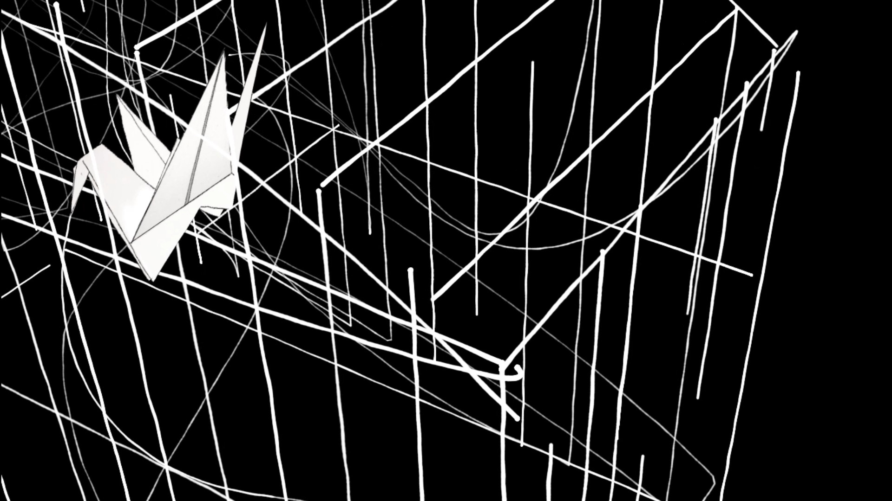

<div class="page"/>

# Coorpel Oficina de Estêncil

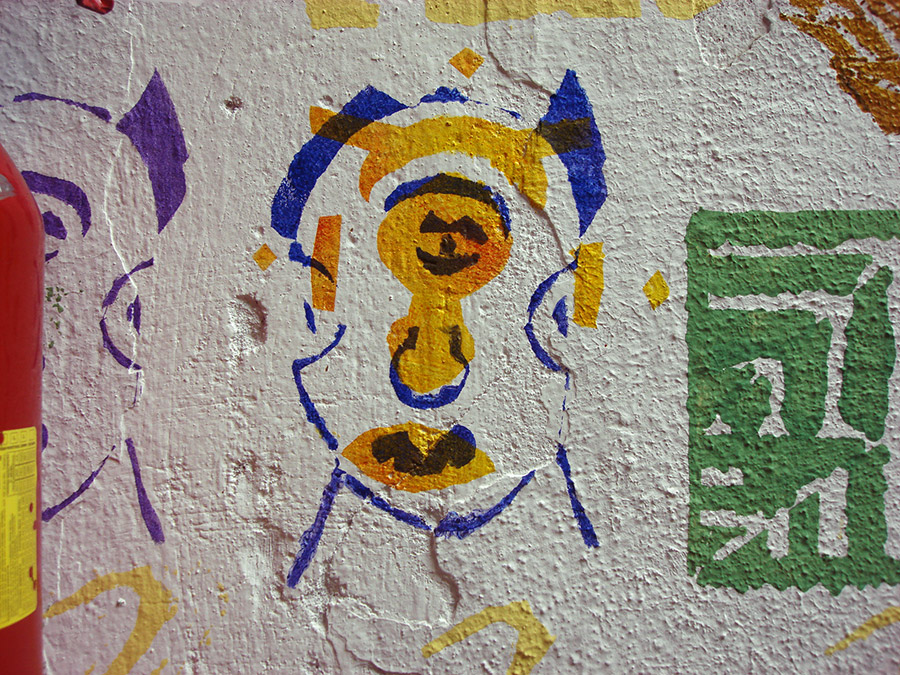

## Workshop para pessoas em processo de admissão na Cooperativa de reciclagem de resíduos - Coorpel  

São Paulo, agosto a novembro de 2011

No ano de 2011 realizei uma oficina de estêncil na cooperativa de reciclagem de resíduos “Coorpel” em São Paulo para “pessoas em situação de rua” (pode-se dizer “sem-teto” mas este não seria um termo preciso) que estavam em processo para ser aceitos como membros da cooperativa.

O workshop pretendeu ampliar a capacidade de expressão dos participantes, estimular sua criatividade, aumentar sua confiança, autoestima e capacidade de compreensão do mundo que as cerca. Proporcionando ao mesmo tempo momentos agradáveis ​​de trabalho em equipe e aprendizado.

O estêncil foi escolhido como base da prática desta oficina para ser um processo barato, simples, prático, repleto de possibilidades de recombinação, englobando em seu processo de produção elementos básicos da arte como desenho, uso da cor, composição, síntese, figuração e abstração.

As individualidades se expressariam em favor de obras coletivas, trocando experiências e tarefas. Assim, os participantes tiveram a oportunidade de aprender uns com os outros e perceber que existem múltiplos caminhos e possibilidades de expressão ou realização de ideias.

A produção feita em uma aula servia de base para a discussão sobre a que viria a seguir. Assim, uma linha que une uma aula à outra é criada e torna claro o significado da oficina como um todo. Permitindo-se provar que eles podem sim desenhar, fazer composições interessantes e expressivas, tornando-os desinibidos e desmistificando a prática artística. Discutíamos o conteúdo de suas produções e a partir daí, mergulhávamos em direção a seus imaginários, repertórios e experiências, dando novos significados a eles através da arte, coletivamente.

Materializar as imagens internas, combinar, comparar e misturar com o imaginário coletivo, pode ser esclarecedor e nos fazer sentir parte de um grupo com quem podemos compartilhar algo de semelhante. As aulas foram realizadas respeitando o repertório de cada um.

Trabalhávamos em torno daquilo que fazia sentido para os participantes, para ampliar sua percepção, reflexão e sensibilidade. Trazendo novos conteúdos, expandindo seu repertório em relação ao estêncil, e de forma semelhante à rua e à arte gráfica como um todo. Os conceitos de “certo e errado” e “Beleza” não faziam parte desta ofcicina.


