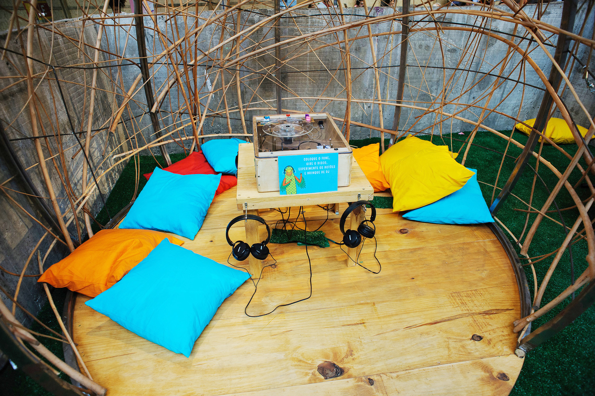
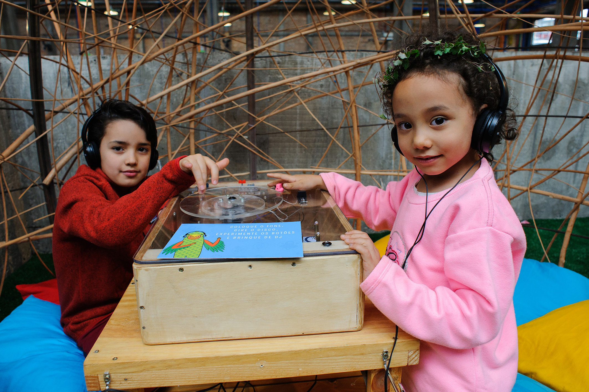
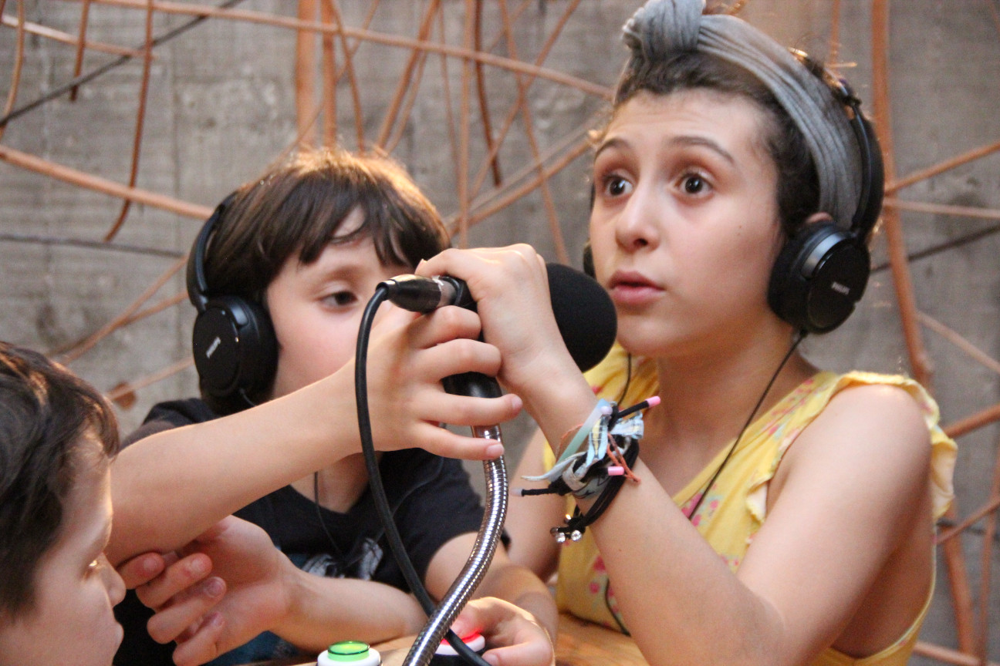
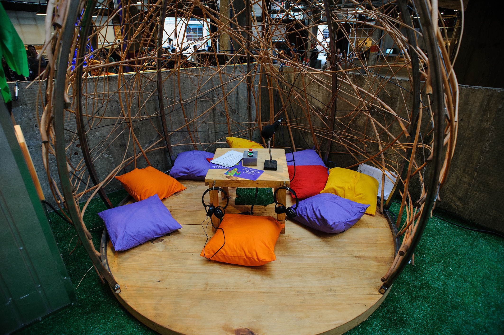
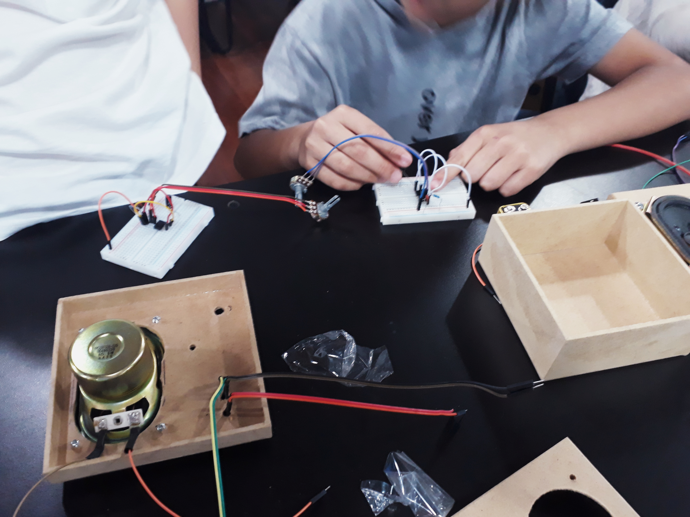

# Maritaca Station

On the occasion of the Estação Maritaca (Maritaca Station) event at SESC Pompéia in October 2018, I created two child trachytes and I gave a workshop where the children built a "musical toy". The idea behind the event, designed by the artist Mariana Piza, was to give children experiences from a radio station.

---

## Maritronic Turntable

The Maritronic Turntable is a gadget that mixes the possibilities of a mixer, a turntable and a music selector, all in a box with transparent top so that the children can see and be curious about the components that allow their operation.
Kids can scratch using a disc and crossfader, choose and combine loops of songs, change the volume and the speed with which these loops are played.  
The design of the box, the rotating disk and the acrylic cover are the artist and set designer Julio Dojcsar.  
The Vitrola Maritrônica was arranged in a kind of igloo (scenography by Marisa Bentivegna) in which four children could interact with the traquitana at the same time.

### The gears

In superficial terms the Maritronic Turntable works as follows.
Two prototyping boards, [Arduino](https://www.arduino.cc/) Duo and [Teensy Board](https://www.pjrc.com/teensy/), digitize and process data from faders and rotary knobs (encoders) as well as spinning discs.
A single board computer [Raspberry Pi](https://www.raspberrypi.org/) running the [SuperCollider](https://supercollider.github.io/ "audio server, IDE and programming language for sound synthesis and algorithmic composition") with an expecially written program for the device.
A special sound card for the Raspberry Pi turns the signals generated by SuperCollider into real sound.

[back to top](#maritaca-station)

---

## Maritaca Recorder

The Maritaca Recorder is an object with which the children hear listen to tips for them to record stories and make interviews with each other. Through a simple interface they operate and record without needing help this gadget.  
The recordings are stored and made available for use in the Maritaca application.

### The Gears

Inside the metal case is a Teensy development board attached to a specific audio card, to which the microphone and earphones are connected. The recordings are stored in an SD card.

[back to top](#maritaca-station)

---

## Traquitronic - Musical Toy Workshop

In this workshop aimed at children from the age of eight, we built simple electronic instruments together, with simple elements, without soldering or complicated circuits. They can touch them with gestures, controlling the light, and buttons, and still combine the instruments of each other.
At the end participants can bring their instruments home.

Based on an integrated circuit, we build on prototyping boards a simple circuit that generates electrical pulses at audible frequencies, which we hear through small speakers. Frequencies can be modulated using light sensors and rotary knobs.
In the end, as experimentation, the instruments can be combined together, generating cross modulation and thus, more complex sounds.

### The goals

* learning basic principles of electrical, electronic and audio, from practical activity.
* Construction of an electronic instrument that can be taken by the participants.

### Specifics

Based on an integrated circuit, we build on a prototyping board a simple circuit that generates electrical pulses at audible frequencies, which we hear through small speakers. Frequencies can be modulated using light sensors and rotary knobs.
In the end, as experimentation, the instruments can be combined together, generating cross modulation and thus, more complex sounds.

<iframe style="width:100%;height:416px;" src="https://www.youtube.com/embed/px9Je3Rxayc?rel=0&amp;showinfo=0" frameborder="0" allow="accelerometer; autoplay; encrypted-media; gyroscope; picture-in-picture" allowfullscreen></iframe>

[back to top](#maritaca-station)
