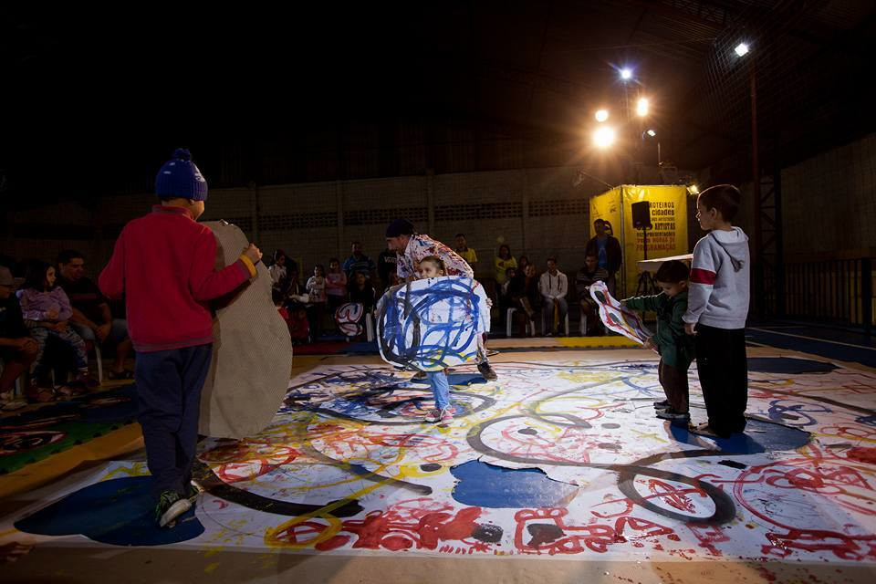
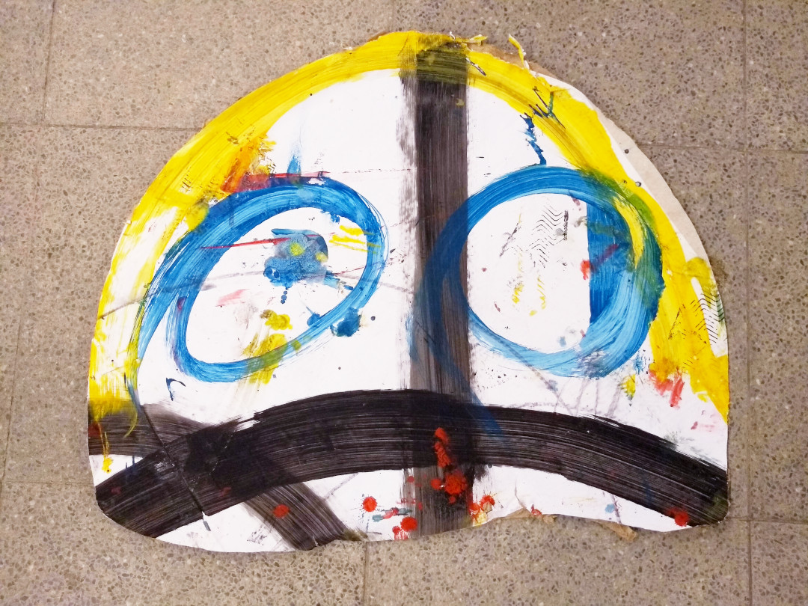

# Flou

I am honoured to have been invited to craft the sounds and music of his performance of live-drawing: FLOU! by Ieltxu Martinez Ortueta, a multi talented artist and father, as he explains below. The concepts which he deals combining body movements, drawing and painting, cutouts and also street-art, are analog to the ones I have been dealing in my media-art practice. Different languages intersecting to open possibilities of a multitude of meanings and interactions.
Below comes the text we made together.

Perhaps draw or do some trace on paper is one of the first artistic expressions of a child. This act of printing a mark, to trace, brings me back to when our ancestors were drawing in caves and pits. Something about this act has potency in an act of vital necessity, of wonder as the pencil glides over the surface, claiming an ever genuine and
unique trait. One of the most intense, exultant and pleasurable actions I observe in my children is when they huddle over the paper and start scribbling it and fills it with strokes, lines, and shapes, it seems that in this act the symbiosis of body gesture acts in motion and creation, is full and traversing.

FLOU! is an investigation on the gesture, the stroke, movement, drawing, ink and apparently not figurative forms which appropriate the act of drawing. An act that does not attempt for a specific outcome, but a dive in the material and the “seriously” play like every child does.

FLOU! works from random drawing concepts, the superposition of paint, black, red, blue and yellow, that fills the empty white surface, letting the shapes takes the space, gradually being the protagonists, meaning and re-meaning depending on the artist and the children and parents gaze who participate in the FLOU! experience. When the action of drawing and painting finishes, cut out shapes emerge of the space itself to propose an interactive game of inset pieces in which each composition refer to the imagination of each artist.

Yes, we are all artists. FLOU! has not closed meanings, it is a gateway to a universe of shapes and compositions which are configured and reconfigured every time. FLOU! universe links to what its possible at the moment.

The soundtrack and sound design were developed in collaboration with media artist Gil Fuser. The sounds translate the drawings to the spatial dimension. The sounds breathe draw claims and express algorithmically the way of randomness with which drawings are formed. Sound and music in FLOU! are the dimension that connects the designer to the drawing. The music moves the body and the movement becomes drawing, or would it be the reverse? Drawing and paper have life of their own and express themselves through sound. Is creating to give life to something that already exists?

<iframe width="100%" height="300" scrolling="yes" frameborder="no" allow="autoplay" src="https://w.soundcloud.com/player/?url=https%3A//api.soundcloud.com/playlists/156340265&color=%23ff5500&auto_play=false&hide_related=false&show_comments=false&show_user=false&show_reposts=false&show_teaser=true&visual=true"></iframe>

<iframe src="https://player.vimeo.com/video/188162125?title=0&byline=0&portrait=0" style="position:absolute;top:0;left:0;width:100%;height:100%;" frameborder="0" allow="autoplay; fullscreen" allowfullscreen></iframe>

[back to top](#flou)
