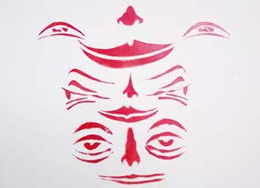
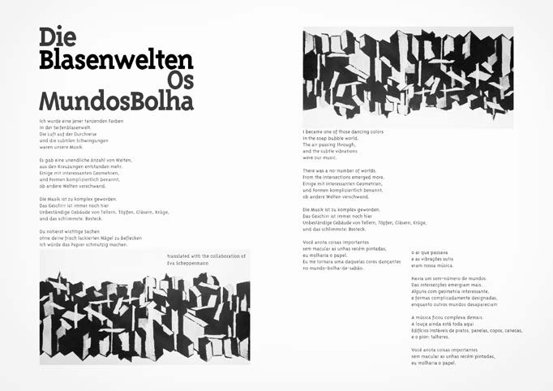
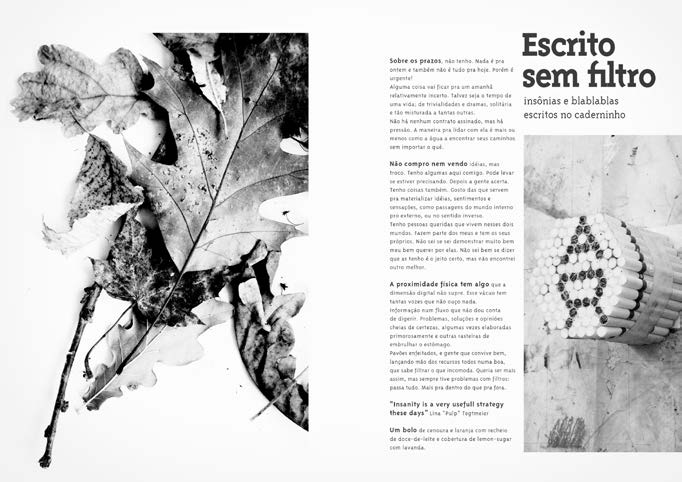

# Reklamiertes Kapital

In October 2013 the graphic artist and illustrator Lina Tegtemeier invited me to work with her in a fanzine (an independent publication. We worked along but with hers and my version of it. I made my version with poetry, pictures, my own photographs and stencils, both that I did and some of the participants of a workshop I gave in São Paulo 2011. The covers were made with exclusive and unique stencils for every copy.

